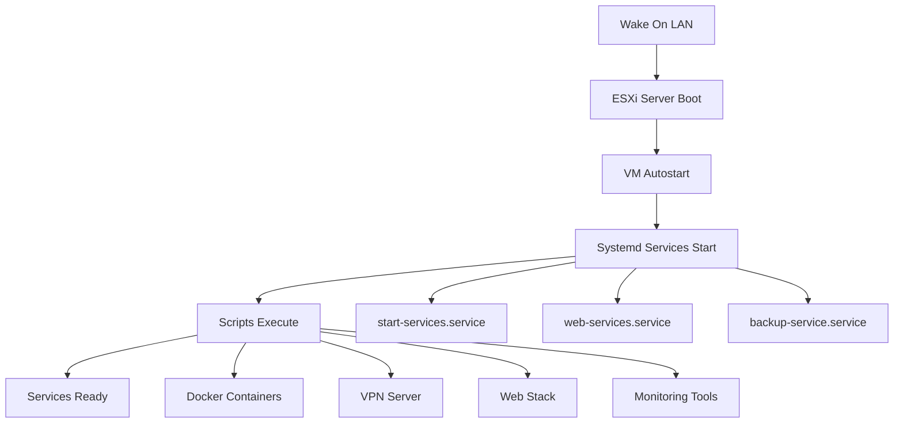

# ESXi VM Autostart & Systemd Service Automation

## Giới thiệu

Sau khi Wake On LAN thành công, bước tiếp theo là đảm bảo các VM và services quan trọng tự động khởi động. Hướng dẫn này tập trung chi tiết vào việc **tạo systemd service** để tự động chạy các script .sh khi VM khởi động.

## 🎯 Mục tiêu

Khi bật server ESXi bằng Wake-on-LAN, cần đảm bảo:

1. **Các máy ảo quan trọng** được khởi động tự động trong ESXi
2. **Các script .sh bên trong VM** được thực thi tự động thông qua systemd services

---

## 🔧 Phần 1: Tự động khởi động VM trong ESXi

### ✅ Thiết lập Autostart trong ESXi

**Truy cập ESXi Web Interface:**
```
https://<IP-server>
```

**Navigation:** Host → Manage → System → Autostart

**Cấu hình:**
- ✅ Enable Autostart
- ✅ Chọn VMs cần tự động khởi động
- ⚙️ Thiết lập delay giữa các VM (khuyến nghị: 30-60 giây)

---

## 🔧 Phần 2: Tạo Systemd Service cho Script .sh (Chi tiết)

### 📁 Cấu trúc thư mục khuyến nghị

```bash
/usr/local/bin/                    # Nơi đặt scripts
├── start-services.sh             # Script chính
├── backup-service.sh             # Script backup
└── monitoring-service.sh         # Script monitoring

/etc/systemd/system/              # Nơi đặt service files
├── start-services.service        # Service file chính
├── backup-service.service        # Service backup
└── monitoring-service.service    # Service monitoring
```

### 🛠️ Bước 1: Tạo Script .sh

#### 📄 Template cơ bản cho file .sh

```bash
sudo nano /usr/local/bin/start-services.sh
```

**Nội dung mẫu:**

```bash
#!/bin/bash

# =============================================================================
# Script: start-services.sh
# Description: Auto-start essential services on VM boot
# Author: Your Name
# Date: $(date +%Y-%m-%d)
# =============================================================================

# Set script variables
SCRIPT_NAME="start-services"
LOG_FILE="/var/log/${SCRIPT_NAME}.log"
PID_FILE="/var/run/${SCRIPT_NAME}.pid"

# Function: Write to log
log_message() {
    echo "$(date '+%Y-%m-%d %H:%M:%S') [${SCRIPT_NAME}] $1" | tee -a ${LOG_FILE}
}

# Function: Check if service is running
check_service() {
    if systemctl is-active --quiet $1; then
        log_message "✅ Service $1 is running"
        return 0
    else
        log_message "❌ Service $1 is not running"
        return 1
    fi
}

# Function: Start service with error handling
start_service() {
    log_message "🔄 Starting service: $1"
    if systemctl start $1; then
        log_message "✅ Successfully started: $1"
    else
        log_message "❌ Failed to start: $1"
        return 1
    fi
}

# Main execution
main() {
    log_message "🚀 Starting ${SCRIPT_NAME} script"
    
    # Create PID file
    echo $$ > ${PID_FILE}
    
    # Wait for network to be ready
    log_message "⏳ Waiting for network..."
    sleep 10
    
    # Example: Start Docker containers
    if command -v docker &> /dev/null; then
        log_message "🐳 Starting Docker containers..."
        docker start vpn-server || log_message "❌ Failed to start vpn-server"
        docker start web-server || log_message "❌ Failed to start web-server"
        docker start database || log_message "❌ Failed to start database"
    fi
    
    # Example: Start specific services
    start_service "nginx"
    start_service "postgresql"
    start_service "redis"
    
    # Example: Run custom commands
    log_message "🔧 Running custom initialization..."
    
    # Mount network drives
    if [ -f "/etc/fstab" ]; then
        mount -a && log_message "✅ Network drives mounted" || log_message "❌ Failed to mount drives"
    fi
    
    # Start VPN if exists
    if [ -f "/usr/local/bin/start-vpn.sh" ]; then
        /usr/local/bin/start-vpn.sh && log_message "✅ VPN started" || log_message "❌ VPN failed"
    fi
    
    # Health check
    log_message "🔍 Performing health checks..."
    check_service "nginx"
    check_service "postgresql"
    
    # Cleanup
    rm -f ${PID_FILE}
    log_message "✅ ${SCRIPT_NAME} completed successfully"
}

# Error handling
error_exit() {
    log_message "💥 ERROR: $1"
    rm -f ${PID_FILE}
    exit 1
}

# Trap errors
trap 'error_exit "Script interrupted"' INT TERM

# Execute main function
main "$@"

exit 0
```

#### 🔒 Cấp quyền thực thi

```bash
sudo chmod +x /usr/local/bin/start-services.sh
```

#### 🧪 Test script thủ công

```bash
sudo /usr/local/bin/start-services.sh
```

### 🛠️ Bước 2: Tạo Systemd Service File

#### 📄 Template Service File

```bash
sudo nano /etc/systemd/system/start-services.service
```

**Nội dung service file:**

```ini
[Unit]
# ============================================================================
# Service: start-services.service
# Description: Auto-start essential services and scripts on VM boot
# ============================================================================

Description=Essential Services Startup Script
Documentation=man:systemd.service(5)
After=network.target network-online.target
Wants=network-online.target
RequiresMountsFor=/usr/local/bin

[Service]
# Service configuration
Type=oneshot
RemainAfterExit=yes
TimeoutStartSec=300
TimeoutStopSec=30

# User and environment
User=root
Group=root
Environment="PATH=/usr/local/sbin:/usr/local/bin:/usr/sbin:/usr/bin:/sbin:/bin"
WorkingDirectory=/usr/local/bin

# Execution
ExecStartPre=/bin/sleep 5
ExecStart=/usr/local/bin/start-services.sh
ExecReload=/bin/kill -HUP $MAINPID

# Security settings
NoNewPrivileges=false
PrivateTmp=true
ProtectHome=true
ProtectSystem=strict
ReadWritePaths=/var/log /var/run /tmp

# Restart configuration
Restart=on-failure
RestartSec=10

# Logging
StandardOutput=journal
StandardError=journal
SyslogIdentifier=start-services

[Install]
WantedBy=multi-user.target
```

### 🛠️ Bước 3: Kích hoạt và quản lý Service

#### 📝 Các lệnh quản lý service

```bash
# Reload systemd để nhận service mới
sudo systemctl daemon-reload

# Kích hoạt service để chạy khi boot
sudo systemctl enable start-services.service

# Khởi động service ngay lập tức
sudo systemctl start start-services.service

# Kiểm tra trạng thái service
sudo systemctl status start-services.service

# Xem log của service
sudo journalctl -u start-services.service -f

# Xem log chi tiết với timestamp
sudo journalctl -u start-services.service --since "1 hour ago"

# Restart service
sudo systemctl restart start-services.service

# Dừng service
sudo systemctl stop start-services.service

# Vô hiệu hóa service
sudo systemctl disable start-services.service
```

---

## 📋 Ví dụ Service Files cho các tình huống khác nhau

### 🐳 Service cho Docker Containers

**File:** `/etc/systemd/system/docker-containers.service`

```ini
[Unit]
Description=Start Docker Containers
After=docker.service
Requires=docker.service

[Service]
Type=oneshot
RemainAfterExit=yes
ExecStart=/usr/local/bin/docker-start.sh
ExecStop=/usr/local/bin/docker-stop.sh
TimeoutStartSec=600

[Install]
WantedBy=multi-user.target
```

### 🌐 Service cho Web Services

**File:** `/etc/systemd/system/web-services.service`

```ini
[Unit]
Description=Web Services Startup
After=network-online.target
Wants=network-online.target

[Service]
Type=forking
PIDFile=/var/run/web-services.pid
ExecStart=/usr/local/bin/web-services.sh start
ExecStop=/usr/local/bin/web-services.sh stop
ExecReload=/usr/local/bin/web-services.sh reload
Restart=always
RestartSec=10

[Install]
WantedBy=multi-user.target
```

### 💾 Service cho Backup Tasks

**File:** `/etc/systemd/system/backup-service.service`

```ini
[Unit]
Description=Backup Service
After=multi-user.target

[Service]
Type=oneshot
ExecStart=/usr/local/bin/backup-service.sh
User=backup
Group=backup
PrivateTmp=true

[Install]
WantedBy=multi-user.target
```

---

## 🔍 Advanced Configuration

### 🕒 Timer-based Services (Alternative to cron)

**File:** `/etc/systemd/system/backup-service.timer`

```ini
[Unit]
Description=Daily Backup Timer
Requires=backup-service.service

[Timer]
OnCalendar=daily
Persistent=true

[Install]
WantedBy=timers.target
```

**Kích hoạt timer:**
```bash
sudo systemctl enable backup-service.timer
sudo systemctl start backup-service.timer
```

### 🔧 Environment Variables trong Service

```ini
[Service]
Environment="API_KEY=your-api-key"
Environment="DB_HOST=localhost"
EnvironmentFile=/etc/default/myservice
```

### 📊 Resource Limits

```ini
[Service]
# Memory limits
MemoryLimit=512M
MemoryHigh=400M

# CPU limits  
CPUQuota=50%

# File limits
LimitNOFILE=65536
```

---

## 🛠️ Troubleshooting & Best Practices

### ❌ Xử lý sự cố thường gặp

#### Service không khởi động
```bash
# Kiểm tra syntax service file
sudo systemd-analyze verify /etc/systemd/system/start-services.service

# Xem log chi tiết
sudo journalctl -u start-services.service --no-pager

# Kiểm tra quyền file
ls -la /usr/local/bin/start-services.sh
ls -la /etc/systemd/system/start-services.service
```

#### Script chạy nhưng không có kết quả
```bash
# Chạy script thủ công để debug
sudo /usr/local/bin/start-services.sh

# Kiểm tra log file
tail -f /var/log/start-services.log

# Test với strace
sudo strace -f /usr/local/bin/start-services.sh
```

### ✅ Best Practices

#### 🔒 Security
- ✅ Sử dụng user riêng thay vì root khi có thể
- ✅ Thiết lập PrivateTmp=true
- ✅ Hạn chế quyền với ProtectSystem
- ✅ Không hardcode passwords trong script

#### 📝 Logging
- ✅ Ghi log chi tiết với timestamp
- ✅ Sử dụng journald thay vì file log riêng
- ✅ Log rotation để tránh đầy disk
- ✅ Structured logging với JSON format

#### ⚡ Performance
- ✅ Thiết lập timeout hợp lý
- ✅ Sử dụng Type=oneshot cho script chạy 1 lần
- ✅ Thiết lập dependencies đúng với After/Requires
- ✅ Tránh sleep không cần thiết

#### 🔄 Reliability
- ✅ Error handling trong script
- ✅ Thiết lập Restart=on-failure
- ✅ Health checks và monitoring
- ✅ Graceful shutdown handling

---

## 📊 Template Scripts cho các use cases phổ biến

### 🔌 Script cho VPN Server

**File:** `/usr/local/bin/vpn-service.sh`

```bash
#!/bin/bash

VPN_CONFIG="/etc/openvpn/server.conf"
LOG_FILE="/var/log/vpn-service.log"

case "$1" in
    start)
        echo "$(date): Starting VPN server..." >> $LOG_FILE
        openvpn --config $VPN_CONFIG --daemon
        ;;
    stop)
        echo "$(date): Stopping VPN server..." >> $LOG_FILE
        pkill -f openvpn
        ;;
    restart)
        $0 stop
        sleep 2
        $0 start
        ;;
    *)
        echo "Usage: $0 {start|stop|restart}"
        exit 1
        ;;
esac
```

### 🌐 Script cho Web Stack (LEMP)

**File:** `/usr/local/bin/web-stack.sh`

```bash
#!/bin/bash

SERVICES=("nginx" "mysql" "php7.4-fpm" "redis-server")
LOG_FILE="/var/log/web-stack.log"

log() {
    echo "$(date '+%Y-%m-%d %H:%M:%S'): $1" | tee -a $LOG_FILE
}

for service in "${SERVICES[@]}"; do
    if systemctl is-active --quiet $service; then
        log "✅ $service is already running"
    else
        log "🔄 Starting $service..."
        if systemctl start $service; then
            log "✅ Successfully started $service"
        else
            log "❌ Failed to start $service"
        fi
    fi
done

# Health check
sleep 5
nginx -t && log "✅ Nginx config is valid" || log "❌ Nginx config error"
```

---

## 🚀 Complete Automation Workflow



---

## 🎓 Giá trị học tập DevOps

**Infrastructure as Code**: Systemd services như code có thể version control  
**Service Orchestration**: Hiểu dependencies và startup sequence  
**Monitoring & Logging**: Centralized logging với journald  
**Security**: Principle of least privilege với systemd security features  
**Automation**: Complete hands-off deployment và recovery  

---

## 🔗 Resources và tài liệu tham khảo

- [Systemd Service Documentation](https://www.freedesktop.org/software/systemd/man/systemd.service.html)
- [Systemd Best Practices](https://www.freedesktop.org/software/systemd/man/daemon.html)
- [Wake On LAN Setup Guide](Wake-On-LAN.md)
- [Network Service Exposure](Port-Forwarding.md)

---

*💡 **Pro tip**: Sau khi setup xong, test bằng cách reboot VM và kiểm tra tất cả services có start đúng không. Luôn có backup plan!*